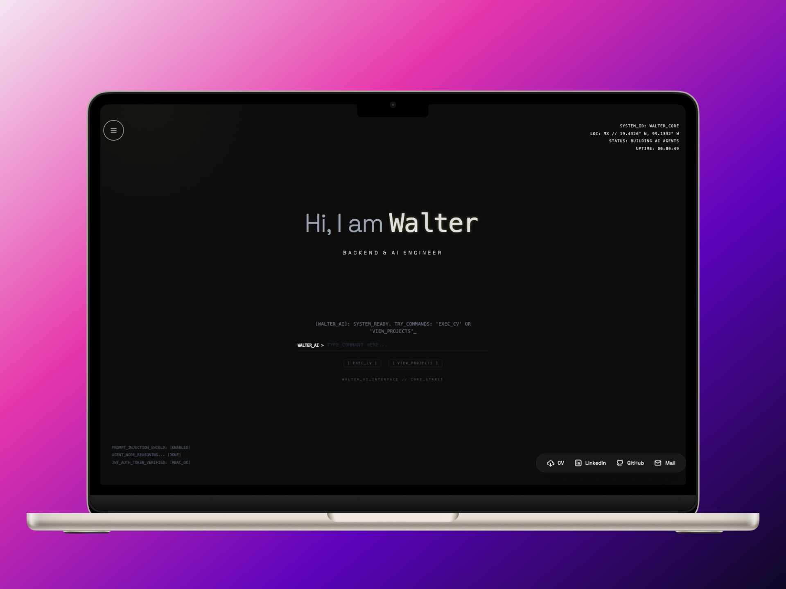
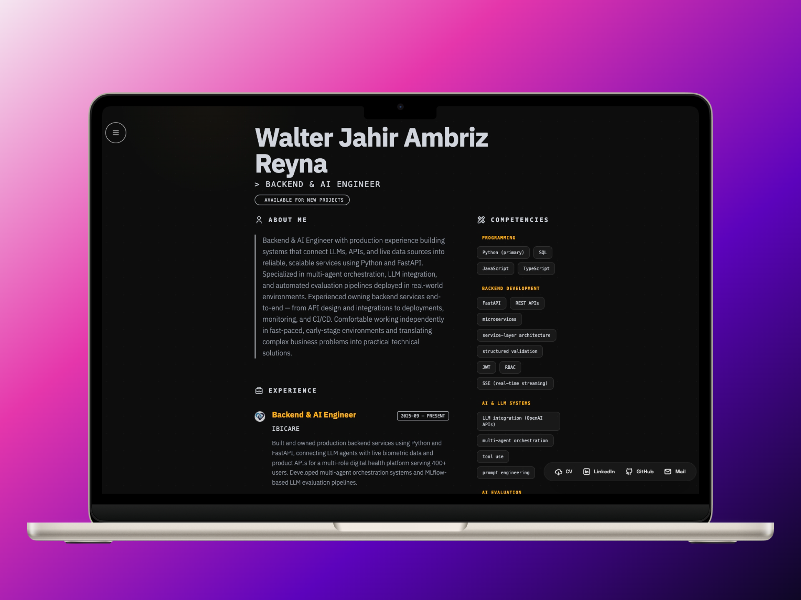

# 🌐 Walter Ambriz | Backend & AI Engineer Portfolio

[](https://angular.io/)
[](https://tailwindcss.com/)
[](https://fastapi.tiangolo.com/)
[](https://github.com/features/actions)

A high-performance, interactive portfolio featuring a retro-terminal aesthetic and an integrated AI assistant (**WALTER_AI**). Built for speed, responsiveness, and seamless user interaction using the latest web standards.

🔗 **Live Demo:** [walterambriz.dev](https://amnotwallas.github.io/Portfolio/#/home)




---

## 🚀 Key Features

### 🤖 WALTER_AI Neural Core
An intelligent assistant powered by **Llama 3.1** via Groq. Unlike standard bots, it acts as an **Orchestrator** for the portfolio.
- **Context-Aware:** Deep knowledge of my professional background, technical stack, and project highlights.
- **Autonomous Navigation:** Capable of triggering site-wide redirects (e.g., `[NAV:CV]`, `[NAV:PROJECTS]`) based on conversational intent.
- **Real-time Feedback:** Terminal-style "thinking" states and streaming responses.

### ⌨️ Advanced Retro Experience
- **Scramble Text Animation:** Custom logic for smooth character transitions on dynamic content.
- **GPU-Accelerated Visuals:** High-performance effects (Scanlines, CRT flicker) optimized for 60FPS with minimal CPU overhead.
- **Signal-Based Architecture:** Fully reactive UI powered by Angular Signals for optimal performance.

---

## 🛠️ Tech Stack

### Frontend (The "Shell")
- **Framework:** Angular 21 (Signals, Standalone Components, Clean Architecture)
- **Styling:** Tailwind CSS v4, PrimeNG v21 (Lara Modern Theme)
- **Icons:** `@ng-icons` (Lucide, Tabler Icons)
- **Unit Testing:** Vitest with JSDOM

### Backend (The "Neural Core")
- **Language:** Python 3.11+
- **Framework:** FastAPI
- **AI Engine:** Llama 3.1 (Groq API)
- **Architecture:** Multi-Agent Orchestration with Function Calling

---

## 📂 Project Structure

```text
src/
├── app/
│   └── frontend/
│       ├── common/          # Shared components (Footer, SpeedDial) & Services
│       ├── pages/           # Core views (Home, CV, Wrapper)
│       └── app.routes.ts    # Reactive navigation logic
├── assets/
│   └── data.json           # Single source of truth for all portfolio content
└── environments/           # CI/CD secret injection placeholders
```

---

## ⚙️ Development

### Prerequisites
- **Node.js:** v20+
- **Package Manager:** npm (v11+)

### Local Setup
1. **Clone & Install:**
   ```bash
   git clone https://github.com/amnotwallas/portfolio.git
   cd portfolio
   npm install
   ```

2. **Environment Configuration:**
   Create a `src/environments/environment.ts` (or modify the prod one) and ensure you have your `WALTER_AI_API_KEY`.

3. **Run Development Server:**
   ```bash
   npm start
   ```

4. **Testing:**
   ```bash
   npm test
   ```

---

## 🚢 Deployment & CI/CD
This project uses **GitHub Actions** for automated delivery:
- **Secret Injection:** The `WALTER_AI_API_KEY` is injected into the environment files during the build process.
- **Routing Fix:** Automatically generates a `404.html` from `index.html` to support client-side routing on GitHub Pages.
- **Hosting:** Deployed via GitHub Pages on every push to `main`.

---
*Developed with focus and precision by Walter Ambriz // AI & Backend Engineer*
